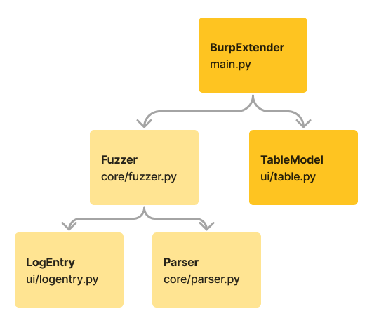

# XSS Detector

XSS Detector is a Burp Suite extension that parses all requests, inserts an XSS payload into
- Every POST request, from every source (proxy, repeater, intruder, extender);
- `application/x-www-form-urlencoded`, `application/json`, `multipart/form-data`.

## PoC
Check [usage/README.md](usage/README.md) for usage instructions.

[This URL](http://i.geraldino2.com/dr?status=200&body=ok) should reply every request with a 200. Feel free to use it during tests.

## Structure
TODO

Additional documentation is available [here](docs.md).

### TODO
TODO