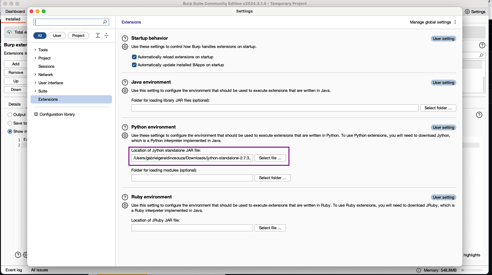
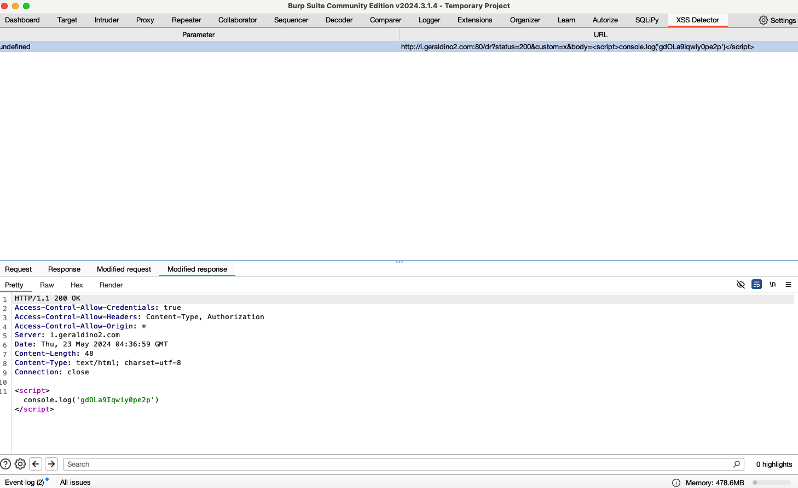

# XSS Detector

XSS Detector is a Burp Suite extension that performs active XSS scans, using a headless browser. It is designed to have (almost) no false positives. Currently, it supports GET requests with no additional headers and DOM-based XSS.

## PoC
[This URL](http://i.geraldino2.com/dr?status=200&body=ok) is vulnerable to rXSS and can also be modified to DOM-Based XSS.

## Installation
- Change the path to your `chromedriver` in `CHROMEDRIVER_PATH:core/webdriverxss.py`. `chromedriver` can be downloaded [here](https://googlechromelabs.github.io/chrome-for-testing/#stable).

- Install pip dependencies
```
$ java -jar $JYTHON_JAR_PATH -m ensurepip # install pip
$ java -jar $JYTHON_JAR_PATH -m pip install selenium # install selenium
```

- Setup Python env, Jython


- Import main.py


- Send requests to scan


- XSS Detector tab


## Structure
The defined code structure is pretty simple, and similar to `GET Checker`. `main.py` implements `BurpExtender`, deals with all that is needed to setup the extension, sets up the UI and creates a Scanner. The UI is defined in ui, managing the table and log entries.

`scanner.py` defines `Scanner`, who is responsible to parse requests using auxiliary modules (`parser.py`, `textutils.py`) and to create XSS payloads based on the request.

The modified request is then sent to a Chrome headless browser, defined at `webdriverxss.py` using Selenium. The browser runs the page and verifies if the payload was executed (allowing DOM-based attacks). If so, a new `LogEntry` is placed into the table. Payloads are currently hardcoded to be a log containing `XSS_MAGIC_STR:core/webdriverxss.py#L7`.


Additional documentation is available [here](docs.md).

### TODO
- Fix parameter field of LogEntry;
- Support headers and POST requests (migration from Selenium might be required);
- Support Blind XSS;
- Support more payloads (beyond `XSS_MAGIC_STR` and `console.log`);
- Improve logging.
