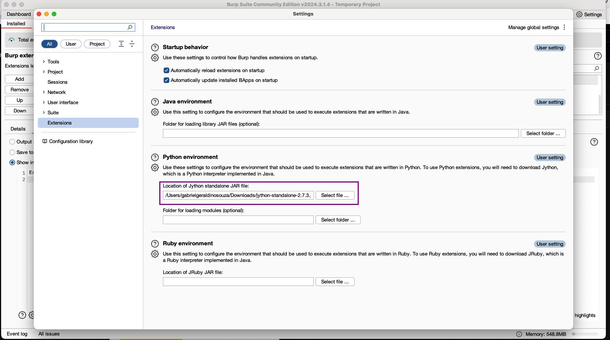
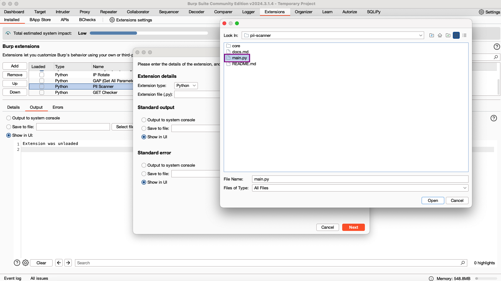
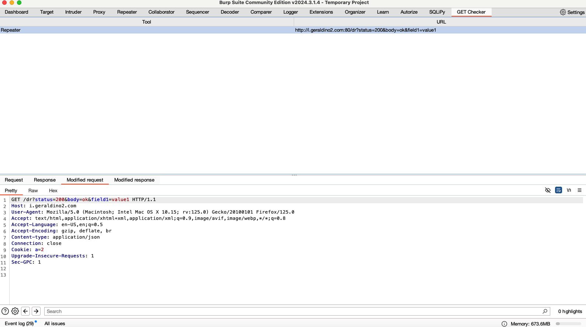

## Usage

Usage is similar to [PII Scanner](https://github.com/geraldino2/pii-scanner/), there is no additional setup after importing the extension.

- Setup Python env, Jython

- Import main.py

- GET Checker tab

